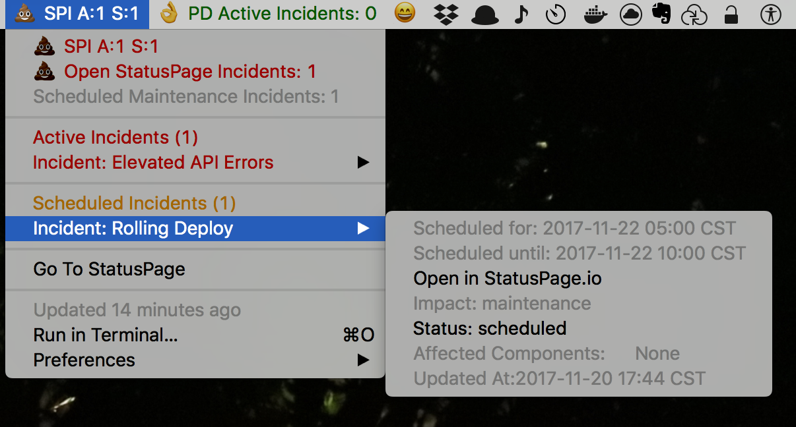
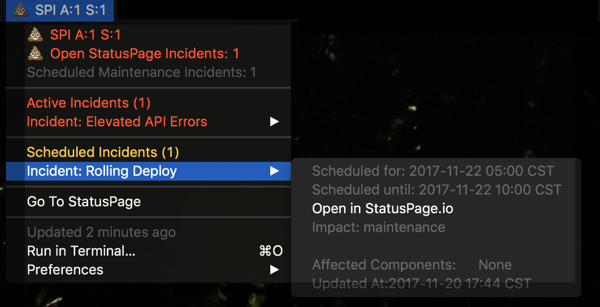

# StatusPage.io Show Tool
This tool was written for use via [BitBar](https://github.com/matryer/bitbar#writing-plugins). It will show the status from your statuspage.io page. You will see open incidents, but can also see recent closed incidents as well as scheduled ones.

# Screenshots

# Installation
First, decide if you are going to use it in script mode or via the
binary. This document will assume the use of the binary. If you intend
to run as a script, you should already know how. ;) If you already have
BitBar with plugins installed, put it in your plugin directory.

Personally, I like to have a `~/BitBar` directory with a pair of
subdirectories: `Available` and `Enabled`. I configure my plugins
directory to be `Enabled`, so I can put the plugins I want to use in
`Available` and symlink in `Enabled` but use refresh settings. For
example: if you want this plugin to refresh once every five minutes, put
it in `Available`, then in `Enabled` execute:

`ln -s ../Available/spshow spshow.5m.bin`

# Configuration
This app needs configuration. To keep it simple, copy the sample.config
from the repo to `~/.pdshow` and edit it to put in your PageID and
auth token. If you want to change the "icons", which are actually emoji,
feel free to edit them in - but be sure they are "github supported"
emoji. 

The main section has "title" and "Baricon" fields. The title sets the text (can
be left blank) to put between the Baricon and the incident counts. This is
useful for running more than on instance. The Baricon is a base64 encoding of
the image to use. It should be devoid of color and 16ptx16pt to fit in bar and
with the bar's other icons. 

The default is the StatusPage.io logo so converted.  You could use a company or
page logo here.  The way to do that, assuming you have an image of the right
specs, is to do `base64 -i filename.png` and copy the output into the Baricon
field in the config file.

If you look at the remaining sections you will see one for "scheduled" and one
for "resolved". These sections control what the app does about scheduled and
resolved incidents in statuspage. For example, if you don't care to see
scheduled incidents, set `enabled=false` and they will not be shown.

If you have multiple accounts to monitor, make a file for each, and instead of
calling the binary, use a shell script which passes `-c ~/.OTHERCONFIGFILE` or
the full path for each and you should see them both show. Also: My condolences
on monitoring more than one.

## Why not one of the others?
First, this started as a different tool, so converting it was fairly simple.
Second, I didn't know about them until after I have built it. Besides, I prefer
the model of having a config (or CLI flags) to hardcoding everything into
scripts. 

# TODO
- [ ] The Statuspage client I am using is ... less than complete and somewhat annoying. Thus I need to fix it as well as add some missing calls such as the page info API. I'll probably fork it and run with that.
- [ ] more customization options such as conditional colors
- [ ] Actions: I'd like to explore options for creating incidents and updating them from the menu as well.
- [ ] config options for incident cycling
- [ ] config options for titles
- [ ] move to text/template to enable better control and flexibility
- [ ] explore ways of doing more interaction or local window information display such as a detailed view of an incident or an update form.
